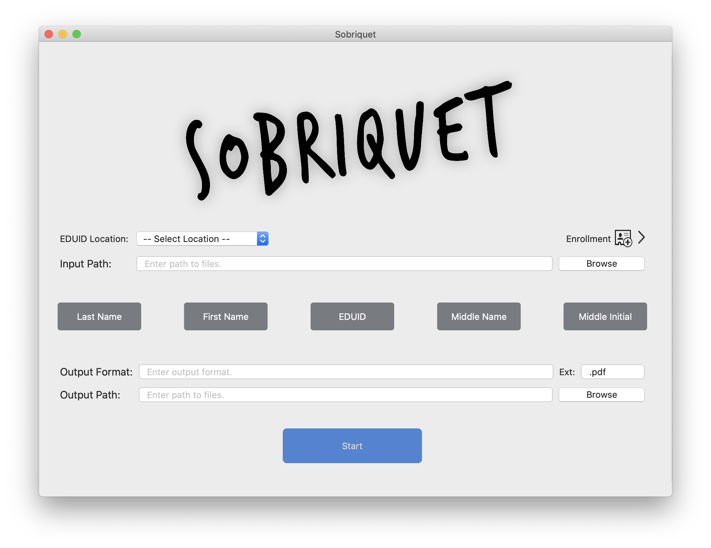

# Sobriquet
A tool for renaming files.

### What does it do?

This app's functionality is quite narrow. Take a directory full of PDFs with a 9-digit identifier in either
the file name or somewhere in the PDF and rename all of those files to adhere to a given format. The PDFs
carry student information, so the program uses a database of those student contains their first and last names
as well as the identifier mentioned above. This database can be subsequently updated.

The "rename" is carried out as a copy.

